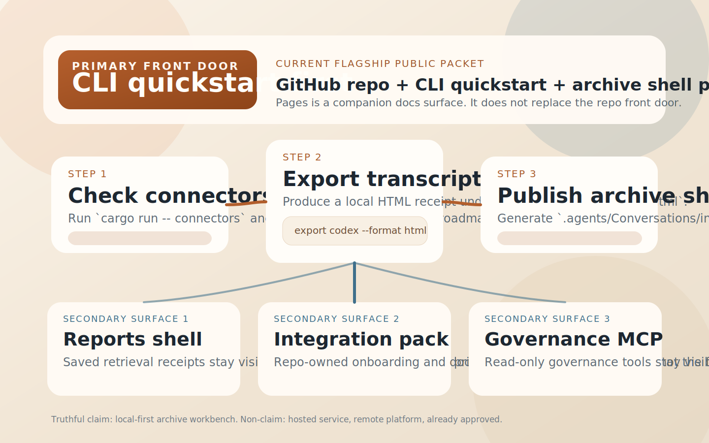

# agent-exporter

`agent-exporter` is a **local-first archive and governance workbench for AI agent transcripts**.

[Try It In 3 Steps](#first-success-path) · [Zero-Context First Look](#zero-context-first-look) · [Docs Landing](https://xiaojiou176-open.github.io/agent-exporter/) · [Archive Shell Proof](https://xiaojiou176-open.github.io/agent-exporter/archive-shell-proof.html) · [Latest Release](https://github.com/xiaojiou176-open/agent-exporter/releases/latest)



## Product Kernel

The simplest way to understand this repo is:

> It turns transcript export, archiving, retrieval, evidence, and governance into a local-first workbench first,
> instead of pretending to be a hosted service or remote platform.

## Surface Model

- **Primary Surface:** `CLI-first`
- **Secondary Surface 1:** local archive shell / reports shell
- **Secondary Surface 2:** repo-owned integration pack
- **Secondary Surface 3:** read-only governance MCP bridge

These surfaces can coexist, but they cannot borrow authority from each other.
Secondary operator-facing surfaces must not replace the current primary front door.

## Flagship Public Packet

The flagship public packet for the current stage is:

> **GitHub repo + CLI quickstart + archive shell proof**

That does not mean the other surfaces do not matter.
It means each surface must clear its own review line, instead of turning a partial secondary readiness signal into a repo-wide public-ready claim.

## Front Door Today

If this is your first visit, use the repo in this order:

1. **Start with the CLI quickstart**
2. **Then inspect the archive shell proof**
3. **Only then branch into reports shell, integration pack, or governance lanes as needed**

In plain English:

> The product kernel already includes evidence and governance,
> but the public front door still needs **CLI-first** to own the first screen.

## At A Glance

If you want the shortest truthful filter before reading deeper, use this table:

| What you need to know | Current answer |
| --- | --- |
| Primary surface | `CLI-first` |
| Zero-context start | `scaffold` -> `connectors` |
| First success | `connectors` -> `export codex --format html` -> `publish archive-index` |
| First visible proof | a local HTML transcript receipt plus the tracked archive-shell proof page |
| What it must never be reduced to | a hosted archive platform, generic remote transcript service, or `MCP-first` public product |

## Zero-Context First Look

If you do not have a real thread id yet, start here instead of guessing what
the repo expects:

1. **Read the local workbench shape**

   ```bash
   cargo run -- scaffold
   ```

2. **See which transcript sources already exist**

   ```bash
   cargo run -- connectors
   ```

This is the zero-context sample path. It proves the command surface and current
source model before you point the repo at a real transcript.

When you are ready to produce a real receipt, move to the first-success path
below.

## First Success At A Glance

If you only want to answer "is this worth trying once?", use this card first:

| Step | You run | You get |
| --- | --- | --- |
| `1` | `cargo run -- connectors` | a readback of the current transcript sources |
| `2` | `cargo run -- export codex ... --format html --destination workspace-conversations ...` | a browsable HTML transcript receipt |
| `3` | `cargo run -- publish archive-index --workspace-root ...` | `.agents/Conversations/index.html` archive shell |

> Think of these three steps like assembling the frame of a workbench.
> Get it standing first, then worry about drawers and accessories.

## Public Entry Points

- **GitHub repo front door:** the current primary onboarding path with the CLI quickstart
- **GitHub Pages landing:** a lightweight public docs layer that repeats the same product sentence and first-success path
- **Archive shell proof page:** a tracked public explanation of what the archive shell proves, what it does not prove, and how to reproduce it locally
- **Host-native public skill packet:** `public-skills/agent-exporter-archive-governance-workbench/` for host reviewers who need a self-contained folder
- **Latest release shelf:** release/tag truth for the current public packet

## Release Shelf Truth

Use the latest release shelf when you need the newest **published** packet:

- the newest tagged binary artifacts
- the release notes for the current shipped cut
- the public packet state that has already been frozen into a release

Use the README, Pages docs, and repo map when you need the newest
**repository-side truth** on `main`:

- front-door wording and proof hierarchy
- packet / lane truth that may have moved after the last tag
- governance or documentation hardening that landed after the latest release

Those shelves should stay coherent, but they are not the same shelf. A newer
`main` can sharpen docs, packet truth, or governance wording before the next
tagged release is cut.

## First Success Path

Treat first success as: confirm the connector surface, export one transcript, and then publish it into the archive shell.

1. **Inspect the current connector surface**

   ```bash
   cargo run -- connectors
   ```

2. **Export one HTML transcript into the current workspace**

   ```bash
   cargo run -- export codex \
     --thread-id <thread-id> \
     --format html \
     --destination workspace-conversations \
     --workspace-root /absolute/path/to/repo
   ```

3. **Publish the archive shell proof**

   ```bash
   cargo run -- publish archive-index --workspace-root /absolute/path/to/repo
   ```

Success signals:

- a `.agents/Conversations/*.html` transcript export
- a `.agents/Conversations/index.html` archive shell
- a **local-first HTML receipt**, not a hosted demo and not a GitHub Pages live runtime

## Open The Right Next Door

Once those three steps work, open the next surface that matches your next
question instead of treating every lane as the same thing:

| If you want to... | Open this next | Why |
| --- | --- | --- |
| understand what the archive shell proves | [archive shell proof](https://xiaojiou176-open.github.io/agent-exporter/archive-shell-proof.html) | this is the first public proof layer after the CLI path |
| inspect the docs map and current lane hierarchy | [`docs/README.md`](./docs/README.md) | it keeps the product map and proof hierarchy in one place |
| inspect packet and listing truth after the product story is clear | [`docs/distribution-packet-ledger.md`](./docs/distribution-packet-ledger.md) | packet status is a second-ring truth surface, not the first success path |
| inspect the host-native skill packet | [`public-skills/README.md`](./public-skills/README.md) | this is the secondary host-review lane, not the flagship front door |

## Proof Ladder

Do not treat public proof as one giant all-purpose badge.
Treat it as a 3-step ladder:

| Level | What it proves | Current asset |
| --- | --- | --- |
| `L1` | the CLI can get you through the front door | `First Success Path` |
| `L2` | transcript export leaves behind a browsable receipt | `.agents/Conversations/*.html` |
| `L3` | the archive shell organizes transcript, reports, and integration evidence into one local-first workbench | [archive shell proof](https://xiaojiou176-open.github.io/agent-exporter/archive-shell-proof.html) |

## Public Boundary Right Now

Keep the current public boundary clear so "can generate" does not silently become "already live":

- **public front door:** GitHub repo + CLI quickstart remains the primary entry; GitHub Pages is a companion docs surface, not a second primary door
- **first truthful visible proof:** the tracked archive shell proof page plus a locally reproducible archive shell HTML receipt
- **secondary surfaces:** reports shell, integration pack, and the read-only governance MCP bridge remain secondary surfaces and do not take over the headline
- **cannot claim yet:** `submit-ready`, `already approved`, `MCP-first`

## Does / Does Not Prove

| This repo can honestly prove today | This repo must not overclaim today |
| --- | --- |
| the CLI quickstart works | a hosted archive platform |
| transcript export can become an HTML receipt | a multi-user remote service |
| the archive shell proof page explains the workbench truthfully | `submit-ready` or `listed-live` claims for unrelated non-GitHub lanes |
| secondary surfaces exist as repo-owned lanes | `MCP-first` public positioning |

## Host Safety

This repo can launch a local app-server child process, but it is not a desktop automation driver and not a host cleanup script.

Current hard boundaries:

- only repo-owned app-server children may be managed
- no `killall`, `pkill`, `kill -9`, `process.kill(...)`, `os.kill(...)`, or `killpg(...)`
- no `osascript`, `System Events`, `AppleEvent`, `loginwindow`, or `showForceQuitPanel`
- no detached background runner or `.unref()` patterns
- `--app-server-command` only accepts a direct executable or repo-owned test double, never a shell launcher, host-control utility, or inline-eval entry

See [docs/reference/host-safety-contract.md](./docs/reference/host-safety-contract.md) for the full contract.

---

## Current Positioning

You can think of `agent-exporter` as a **local-first archive and governance workbench**, not a hosted platform.
The front door still has to preserve one order: **CLI first, archive shell proof second, secondary surfaces after that**.

The current stage is easier to understand through this table than through a giant landed-feature paragraph:

| Layer | Current truth | First proof / entry |
| --- | --- | --- |
| CLI core | `export codex`, `export claude-code`, and `--format markdown|json|html` are landed | CLI quickstart |
| Archive shell proof | `publish archive-index` generates the transcript browser, workspace backlinks, and the archive shell | `.agents/Conversations/index.html` |
| Reports shell | `search semantic|hybrid --save-report` generates retrieval receipts and the reports shell | `.agents/Search/Reports/index.html` |
| Integration pack | `integrate`, `doctor integrations`, and `onboard` form a repo-owned companion lane | `.agents/Integration/Reports/index.html` |
| Governance lane | evidence, baselines, policy packs, and remediation now live in the local workbench | archive shell Decision Desk + integration evidence reports |

More directly:

> This repo is no longer "just an exporter",
> but the public front door should still sell **CLI quickstart + archive shell proof** before every side lane.

What is still unfinished at this stage:

- finishing the flagship public packet against the approved `Product Kernel` and `Surface Model`
- letting each secondary surface graduate on its own review line instead of borrowing the front door's authority

## Current Scope

### In scope today

- Codex transcript export
- a frozen export contract and source-layer split
- explicit documentation for what to inherit, what to reference, and what not to copy blindly

### Out of scope today

- hosted or remote search
- hosted or remote semantic platform
- hosted or remote publish
- a hosted browser GUI shell
- browser-side execution
- remote services
- simultaneous multi-connector launch as one public promise

### Explicitly allowed right now

- a local-first GUI / web Decision Desk
  - local static or local service only
  - useful for reading, comparing, deciding, and routing next steps
  - no hosted layer
  - no cloud backend
  - no browser-side execution
  - no merged transcript/search/evidence corpus

## Current Buildout Order

The current buildout order is easiest to remember as five steps:

1. **Get the CLI export spine right**
2. **Turn transcripts into archive shell proof**
3. **Save retrieval results as reports receipts**
4. **Turn the integration pack into a repo-owned companion lane**
5. **Keep governance/evidence as a local read-only lane, not a second primary door**

The complete capability ledger and staged delivery history continue to live in:

- [docs/README.md](./docs/README.md)
- [CHANGELOG.md](./CHANGELOG.md)

In plain language, the point of v1 is not "support everything".
It is:

> **Get the canonical Codex export path right first, then explain the archive shell proof clearly.**

## Repository Layout

```text
src/
├── cli.rs                # CLI entrypoint and command surface
├── connectors/           # source adapters for agent CLIs
├── core/                 # transcript and archive contract
├── model/                # shared models
└── output/               # Markdown / JSON / HTML rendering

docs/
├── adr/                  # architecture decisions
└── reference/            # upstream contracts, external repos, blueprints
```

## Quick Start

```bash
cargo run -- connectors
cargo run -- scaffold
cargo run -- export codex --thread-id <thread-id>
cargo run -- export codex --source local --thread-id <thread-id>
cargo run -- export codex --source local --rollout-path /absolute/path/to/rollout.jsonl
cargo run -- export claude-code --session-path /absolute/path/to/session.jsonl
cargo run -- export codex --thread-id <thread-id> --format json
cargo run -- export claude-code --session-path /absolute/path/to/session.jsonl --format json
cargo run -- export codex --thread-id <thread-id> --format html
cargo run -- export claude-code --session-path /absolute/path/to/session.jsonl --format html
cargo run -- publish archive-index --workspace-root /absolute/path/to/repo
cargo run -- export codex \
  --source app-server \
  --thread-id <thread-id> \
  --destination workspace-conversations \
  --workspace-root /absolute/path/to/repo
```

Notes:

- `connectors`: shows the current connector roadmap
- `scaffold`: shows the current repo state and the actual export entrypoints
- `export codex`: now exposes a dual-source command surface
  - default: `app-server`
  - optional explicit switch: `local`
- `export claude-code`: now exposes a minimal second-connector entrypoint
  - input: `--session-path`
  - result truth: `degraded` by default

### Output format contract

The current export surface supports:

- `--format markdown`
  - the default
  - keeps the round-based Markdown contract
- `--format json`
  - emits a single transcript JSON document
  - reuses the shared archive core
  - does not invent stronger semantics than the transcript actually has
- `--format html`
  - emits a single transcript HTML document
  - reuses the shared archive core
  - stays a static readable document, not a browse or publish shell
  - adds a local archive-shell backlink when the destination is `workspace-conversations`
  - does not inject workspace-only links when the destination is `Downloads`

### Archive index contract

The repo also supports:

- `publish archive-index --workspace-root <repo>`
  - scans `<repo>/.agents/Conversations` for exported HTML transcripts
  - generates a local multi-agent archive shell `index.html`
  - uses relative links to connect transcript pages
  - includes local metadata filters, connector/completeness facets, semantic/hybrid retrieval lane notes, and saved retrieval report links
  - also generates `.agents/Search/Reports/index.html` as a local reports shell
  - keeps semantic and hybrid retrieval in the CLI instead of moving execution into the browser
  - does not do hosted publish, remote search service, gists, or web publishing

### Semantic retrieval contract

The repo also supports:

- `search semantic --workspace-root <repo> --query "<text>"`
  - real embedding-based retrieval over a local archive corpus
  - local model assets by default
  - explicit failure when model assets are missing instead of fake keyword fallback
  - persistent local sidecar indexes reused across later queries with the same assets

### Hybrid retrieval contract

The repo also supports:

- `search hybrid --workspace-root <repo> --query "<text>"`
  - combines semantic scores with lexical metadata scores into one explainable hybrid score
  - reuses the existing semantic persistence chain instead of creating a second one
  - keeps `search semantic` semantically pure
  - stays a local CLI retrieval path, not a hosted or remote semantic platform

### Retrieval report contract

The repo also supports:

- `search semantic --workspace-root <repo> --query "<text>" --save-report`
- `search hybrid --workspace-root <repo> --query "<text>" --save-report`
  - saves the current retrieval result as a static HTML report
  - writes reports to `<repo>/.agents/Search/Reports`
  - keeps reports as search-owned local artifacts rather than sending them back into the transcript corpus
  - lets the archive shell and reports shell link those reports without re-running retrieval in the browser

### Source contract

The source model is easiest to understand as "two legal doors, one primary door":

- `--source app-server`
  - default
  - represents **canonical truth**
  - keeps `thread/read` primary with `thread/resume` fallback
- `--source local`
  - non-default
  - represents **archival truth**
  - supports:
    - `--thread-id <THREAD_ID>` via `state_5.sqlite -> threads.rollout_path`
    - `--rollout-path <PATH>` for direct local rollout reads

### Parameter combination rules

- `app-server`
  - allowed: `--thread-id`
  - forbidden: `--rollout-path`
- `local`
  - allowed: `--thread-id`
  - allowed: `--rollout-path`
  - but never both at once

### `CODEX_HOME` resolution

Under `--source local`, `agent-exporter` resolves the local Codex ledger in this order:

1. `--codex-home <PATH>`
2. environment variable `CODEX_HOME`
3. default `~/.codex`

### Output destination semantics

The CLI keeps the same semantic layer as CodexMonitor and does not silently rewrite destinations:

- default destination: `Downloads`
- repo destination: `<workspace>/.agents/Conversations`

When you choose:

```bash
--destination workspace-conversations --workspace-root /path/to/repo
```

exports land at:

```text
/path/to/repo/.agents/Conversations/
```

If `workspace-root` does not exist or is not a directory, the CLI fails loudly instead of silently redirecting elsewhere.

### Completeness semantics

The current v1 keeps three explicit states:

- `complete`
  - the primary `thread/read(includeTurns=true)` path succeeded
- `incomplete`
  - only used when the upstream explicitly refuses `includeTurns` and the CLI falls back to `thread/resume`
- `degraded`
  - Codex `--source local` archival replay output
  - Claude `--session-path` local session-file import output
  - the structure still follows the canonical contract
  - but it does **not** pretend to be canonical parity

In plain English:

> A successful export is not the same thing as a proven-complete history.
> If the live path had to fall back, the result must say `incomplete`.
> If the result came from a local archival source, it must say `degraded`.

### Advanced debug and test entrypoints

By default, the CLI launches:

```bash
codex app-server
```

If you need a custom launcher or test double, you can override it with:

```bash
--app-server-command <command> --app-server-arg <arg> --app-server-arg <arg>
```

## Documentation Read Order

If you are new to the repo, read in this order:

1. [AGENTS.md](./AGENTS.md)
2. [CLAUDE.md](./CLAUDE.md)
3. [docs/README.md](./docs/README.md)
4. [docs/adr/ADR-0001-source-layering.md](./docs/adr/ADR-0001-source-layering.md)
5. [docs/adr/ADR-0002-codex-first-delivery.md](./docs/adr/ADR-0002-codex-first-delivery.md)
6. [docs/reference/host-safety-contract.md](./docs/reference/host-safety-contract.md)
7. [docs/reference/codexmonitor-export-contract.md](./docs/reference/codexmonitor-export-contract.md)
8. [docs/reference/codex-upstream-reading-list.md](./docs/reference/codex-upstream-reading-list.md)
9. [docs/reference/external-repo-reading-list.md](./docs/reference/external-repo-reading-list.md)
10. [docs/reference/codex-thread-archive-blueprint.md](./docs/reference/codex-thread-archive-blueprint.md)

## Current Truth Sources

This repo uses three truth layers and they should not be flattened together:

1. **CodexMonitor contract**
   - defines what "complete export" actually promises right now
2. **official Codex source**
   - defines the real relationship between `thread/read`, sqlite state, rollout files, and turns
3. **external reference repos**
   - provide implementation ideas, CLI patterns, and output strategies

Important boundary:

> External reference repos can inform design,
> but they do not get to override the current upstream contract.

## What Comes Next

The current blueprint already locks the repo-local product kernel and side-lane hierarchy.

If the repo keeps moving forward, the preferred order is:

1. public surface / metadata / proof packet cleanup
2. surface-by-surface closeout
3. Wave 3 packet / lane / final closeout verification

## Development Commands

```bash
cargo fmt
cargo test
cargo run -- connectors
cargo run -- scaffold
cargo run -- export codex --thread-id <thread-id>
cargo run -- export codex --source local --thread-id <thread-id>
cargo run -- export claude-code --session-path /absolute/path/to/session.jsonl
cargo run -- export codex --thread-id <thread-id> --format json
cargo run -- export claude-code --session-path /absolute/path/to/session.jsonl --format json
cargo run -- export codex --thread-id <thread-id> --format html
cargo run -- export claude-code --session-path /absolute/path/to/session.jsonl --format html
cargo run -- publish archive-index --workspace-root /absolute/path/to/repo
cargo run -- search semantic --workspace-root /absolute/path/to/repo --query "how do I fix login issues"
cargo run -- search hybrid --workspace-root /absolute/path/to/repo --query "thread-1"
cargo run -- search semantic --workspace-root /absolute/path/to/repo --query "how do I fix login issues" --save-report
cargo run -- search hybrid --workspace-root /absolute/path/to/repo --query "thread-1" --save-report
cargo run -- evidence diff --left /absolute/path/to/report-a.json --right /absolute/path/to/report-b.json
cargo run -- evidence gate --baseline /absolute/path/to/report-a.json --candidate /absolute/path/to/report-b.json
cargo run -- evidence explain --report /absolute/path/to/report-b.json
cargo run -- evidence baseline list
cargo run -- evidence baseline show --name codex-main
cargo run -- evidence baseline promote --report /absolute/path/to/report-a.json --name codex-main
cargo run -- evidence policy list
cargo run -- evidence policy show --name codex
cargo run -- evidence promote --candidate /absolute/path/to/report-b.json --baseline-name codex-main
cargo run -- evidence history --baseline-name codex-main
cargo run -- integrate codex --target /absolute/path/to/codex-pack
cargo run -- integrate claude-code --target /absolute/path/to/claude-pack
cargo run -- integrate openclaw --target /absolute/path/to/openclaw-pack
cargo run -- doctor integrations --platform codex --target /absolute/path/to/codex-pack
cargo run -- doctor integrations --platform codex --target /absolute/path/to/codex-pack --explain
```

## Integration Pack

If you want to wire `agent-exporter` into another agent workflow, treat it as a **repo-owned companion lane**, not the public primary door.

Best entrypoints:

- Codex: `docs/integrations/codex.md`
- Claude Code: `docs/integrations/claude-code.md`
- OpenClaw: `docs/integrations/openclaw.md`

Template entrypoints:

- `docs/integrations/templates/`

The most important integration truths right now:

- **entry commands:** `integrate`, `doctor integrations`, `onboard`
- **saved evidence:** `--save-report` writes to `.agents/Integration/Reports`
- **launcher policy:** repo-local binary first; no silent host-home rewrite; no hidden build in read-only checks
- **truth boundary:** the integration evidence shell is a secondary surface and does not turn the product into `MCP-first`

If you need host-by-host install shapes, pack details, launcher rules, or OpenClaw boundaries, go straight to:

- `docs/integrations/*.md`
- `docs/integrations/templates/`

## License

This project is licensed under **MIT**. See [LICENSE](./LICENSE).

`cargo test` also acts as a host-safety gate: if runtime code reintroduces unsafe host-control primitives, the test suite fails.

## Contributing

See [CONTRIBUTING.md](./CONTRIBUTING.md).
