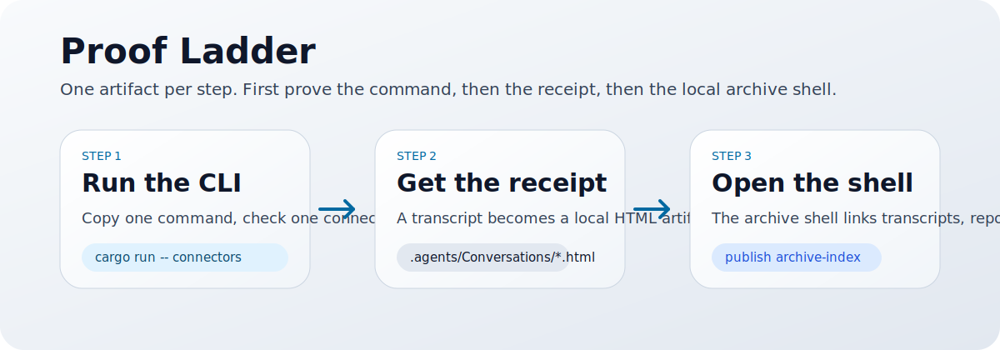

<main id="main-content" role="main" markdown="1">

<section class="ae-hero">
  

    
proof, not platform theatre

    <h1>Use this page to understand what the archive shell really proves before you assign it more authority than it has earned.</h1>
    

      The archive shell proof is the first public explanation layer after the CLI front door.
      It shows that transcript export, report routing, and governance evidence can already be organized into one
      <strong>inspectable</strong> reading surface.
      It does <strong>not</strong> turn the repo into a hosted product or a live remote service.
    

    

      <a class="ae-button ae-button-primary" href="https://github.com/xiaojiou176-open/agent-exporter">Back to GitHub front door</a>
      <a class="ae-button" href="./repo-map.html">Open repo map</a>
      <a class="ae-button" href="./">Return to docs home</a>
    

  

  <aside class="ae-hero-side ae-panel">
    
what this page is for

    <dl class="ae-glance-list">
      

        <dt>Audience</dt>
        <dd>a first-time reviewer trying to separate proof from overclaim</dd>
      

      

        <dt>Main question</dt>
        <dd>What does the archive shell already prove today?</dd>
      

      

        <dt>Boundary</dt>
        <dd>local workbench proof, not a hosted runtime</dd>
      

    </dl>
  </aside>
</section>

<section class="ae-section">
  

    
visual proof assets

    <h2>Two diagrams, two jobs.</h2>
    

      The first diagram shows the workbench shape.
      The second shows the proof ladder from CLI to transcript receipt to archive shell.
      Read them like a map legend, not like a product hype montage.
    

  

  

    <figure class="ae-media-card">
      
      <figcaption class="ae-caption">Archive shell proof map: how transcripts, retrieval receipts, and governance evidence sit on the same local desk.</figcaption>
    </figure>
    <figure class="ae-media-card">
      
      <figcaption class="ae-caption">Proof ladder: the order in which confidence should increase.</figcaption>
    </figure>
  

</section>

<section class="ae-section">
  

    <article class="ae-split-card">
      
what this proof actually shows

      <h2>Real local workbench proof.</h2>
      <ul class="ae-proof-list">
        <li>transcript export can become a browsable HTML receipt</li>
        <li>`publish archive-index` can organize transcripts, reports shell, and integration evidence into one inspectable archive shell</li>
        <li>the archive shell is already <strong>workbench proof</strong>: it can route a reader through local artifacts without pretending to be a hosted platform</li>
      </ul>
    </article>
    <article class="ae-split-card">
      
what this proof does not show

      <h2>Do not promote proof into product theatre.</h2>
      <ul class="ae-proof-list">
        <li>this is not a hosted product demo</li>
        <li>this is not a GitHub Pages live archive shell</li>
        <li>this is not a remote multi-user platform</li>
        <li>this does not automatically mean `submit-ready`, `listed-live`, or `already approved`</li>
      </ul>
    </article>
  

</section>

<section class="ae-section">
  

    
how to reproduce it locally

    <h2>Three commands, one honest result.</h2>
    

      Treat this like checking a lab result for yourself.
      Do not trust the diagram alone; run the path and inspect the artifacts it leaves behind.
    

  

  

    <article class="ae-step">
      01
      <h3>Confirm source availability</h3>
      

        <pre><code>cargo run -- connectors</code></pre>
      

      
You confirm which transcript sources are actually available before you export anything.

    </article>
    <article class="ae-step">
      02
      <h3>Export one HTML transcript</h3>
      

        <pre><code>cargo run -- export codex \
  --thread-id &lt;thread-id&gt; \
  --format html \
  --destination workspace-conversations \
  --workspace-root /absolute/path/to/repo</code></pre>
      

      
This leaves behind a concrete HTML receipt in `.agents/Conversations/`.

    </article>
    <article class="ae-step">
      03
      <h3>Publish the archive shell</h3>
      

        <pre><code>cargo run -- publish archive-index --workspace-root /absolute/path/to/repo</code></pre>
      

      
Now the transcript, reports shell, and integration evidence can be browsed as one local navigation surface.

    </article>
  

  

    After a successful local run you should see `.agents/Conversations/*.html`, `.agents/Conversations/index.html`,
    and navigation paths from the transcript browser into reports shell and integration evidence.
  

</section>

<section class="ae-section">
  

    
proof ladder

    <h2>Confidence should climb in order.</h2>
  

  

    <article class="ae-proof-card">
      
L1

      <h3>CLI front door</h3>
      
The CLI can export a transcript through the truthful front door path.

    </article>
    <article class="ae-proof-card">
      
L2

      <h3>Transcript receipt</h3>
      
The export leaves a browsable HTML receipt rather than a hidden one-off file.

    </article>
    <article class="ae-proof-card">
      
L3

      <h3>Archive shell</h3>
      
The archive shell organizes transcript, reports, and evidence into one navigable local surface.

    </article>
  

</section>

<section class="ae-section">
  

    
next doors

    <h2>After proof, choose the right frozen or reviewer-facing shelf.</h2>
    

      This page explains what the archive shell proves.
      Once that question is answered, the next question is usually one of three:
      do you need the latest published packet, the local stdio host packet, or the wider packet/listing ledger?
    

  

  

    <article class="ae-proof-card">
      
visual companion

      <h3>Promo reel</h3>
      
Use this when you want the shortest visual walkthrough before you open the proof or quickstart layers in detail.

    </article>
    <article class="ae-proof-card">
      
Published shelf

      <h3>Latest release</h3>
      
Use this when you need the newest frozen public packet rather than the newest repository-side wording on <code>main</code>.

    </article>
    <article class="ae-proof-card">
      
Host reviewer lane

      <h3>Local stdio host packet</h3>
      
Use <code>llms-install.md</code> and <code>server.json</code> when the question is specifically about host-side wiring and review packet truth.

    </article>
    <article class="ae-proof-card">
      
Packet truth

      <h3>Distribution packet ledger</h3>
      
Use the ledger when you need platform/listing status, not when you are still trying to understand the product itself.

    </article>
  

</section>

<section class="ae-section">
  

    <article class="ae-note-card">
      
when to open this page

      <h3>You need a proof explanation, not a product tour.</h3>
      
Open this page when someone needs to understand the current proof boundary before evaluating reports shell, integration evidence, or governance lanes.

    </article>
    <article class="ae-note-card">
      
why this matters

      <h3>Truthful product positioning depends on ordering.</h3>
      
`agent-exporter` is already more than an export utility, but its first public proof still has to start with CLI quickstart, transcript export, and archive shell generation.

    </article>
  

</section>

</main>
