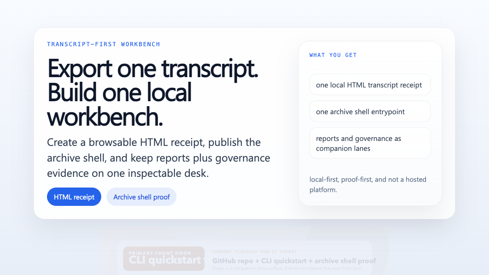

<main id="main-content" role="main" markdown="1">

<section class="ae-hero">
  

    
archive and governance workbench

    <h1>Put transcript export, archive proof, and governance on one desk without pretending to be a hosted platform.</h1>
    

      <code>agent-exporter</code> helps you export one AI agent transcript into a local receipt, then expand that receipt into an archive and governance workbench.
      The CLI stays the real front door because the first honest thing this product should do is generate visible proof.
      This Pages home exists to lower orientation cost: understand the result, run the shortest path, then open the right lane.
    

    

      <a class="ae-button ae-button-primary" href="#first-success">Try the first success path</a>
      <a class="ae-button" href="./promo-reel.html">Watch the promo reel</a>
      <a class="ae-button" href="./archive-shell-proof.html">Inspect archive shell proof</a>
    

    

      <a class="ae-button" href="./launch-kit.html">Open launch kit</a>
      <a class="ae-button" href="https://github.com/xiaojiou176-open/agent-exporter">Open GitHub front door</a>
    

    

      Pages is a <strong>companion docs surface</strong>.
      The primary surface remains the <strong>quickstart path</strong>.
    

    

      Published shelf note:
      the latest release is the frozen public packet,
      while this Pages surface may move ahead with repository-side truth on <code>main</code>.
    

  

  

    
at a glance

    <dl class="ae-glance-list">
      

        <dt>Primary entrypoint</dt>
        <dd>quickstart path</dd>
      

      

        <dt>First proof</dt>
        <dd>one HTML transcript receipt plus one archive shell entrypoint</dd>
      

      

        <dt>Start here</dt>
        <dd>run the first success path before opening side lanes</dd>
      

      

        <dt>Boundary</dt>
        <dd>local-first proof surface, not a hosted runtime</dd>
      

    </dl>
  

</section>

<section class="ae-section">
  

    
visual walkthrough

    <h2>Take the 20-second pass only when it helps you orient faster.</h2>
    

      The promo reel is a compact visual companion for first-time reviewers.
      It does not replace the CLI quickstart or the archive shell proof.
      It exists to lower orientation cost before you run the real path.
    

  

  <figure class="ae-media-card">
    
    <figcaption class="ae-caption">
      Promo reel: a short visual walkthrough of the transcript-first workbench, proof ladder, and lane hierarchy.
    </figcaption>
  </figure>
  

    <article class="ae-proof-card">
      
share-ready asset

      <h3>Social card</h3>
      
Need a single-frame preview for a post, chat share, or reviewer packet? Use the <a href="./assets/media/agent-exporter-social-card.png">social card image</a>.

    </article>
    <article class="ae-proof-card">
      
distribution-prep

      <h3>Launch kit</h3>
      
Once the product story is already clear, open the <a href="./launch-kit.html">launch kit</a> for truthful copy variants and asset routing.

    </article>
  

</section>

<section class="ae-section">
  

    
front door rule

    <h2>Start with the shortest truthful path, then disclose the rest.</h2>
    

      Think of the product like a workshop.
      First you turn on the bench light, then you test one tool, and only after that do you open the cabinets.
      That is why the opening route stays fixed:
      <strong>CLI quickstart first, archive shell proof second, secondary lanes after that.</strong>
    

  

  

    <article class="ae-surface-card">
      
Primary

      <h3>CLI quickstart</h3>
      
The main door proves the product can actually run, not just describe itself.

    </article>
    <article class="ae-surface-card">
      
First visible proof

      <h3>Archive shell proof</h3>
      
The proof page explains what the local workbench already organizes and what it still must not overclaim.

    </article>
    <article class="ae-surface-card">
      
Progressive disclosure

      <h3>Open the next lane only when you need it</h3>
      
Reports shell, integration evidence, and governance stay visible, but they do not compete for the first screen.

    </article>
  

</section>

<section id="first-success" class="ae-section">
  

    
first success path

    <h2>Three steps to a real local receipt.</h2>
    

      If you only want to answer “is this worth trying once?”, do not read every lane first.
      Run these three steps, in order, and let the product prove itself.
    

  

  

    <article class="ae-step">
      01
      <h3>Read the bench shape</h3>
      
See the local workbench structure before you point the repo at a real transcript.

      

        <pre><code>cargo run -- scaffold
cargo run -- connectors</code></pre>
      

      
You confirm the workspace shape and the current connector surface.

    </article>
    <article class="ae-step">
      02
      <h3>Export one HTML transcript</h3>
      
Create one browsable receipt instead of guessing what the output will look like.

      

        <pre><code>cargo run -- export codex \
  --thread-id &lt;thread-id&gt; \
  --format html \
  --destination workspace-conversations \
  --workspace-root /absolute/path/to/repo</code></pre>
      

      
The result is an inspectable HTML receipt inside <code>.agents/Conversations/</code>.

    </article>
    <article class="ae-step">
      03
      <h3>Publish the archive shell</h3>
      
Organize transcript, reports, and evidence into one local navigation surface.

      

        <pre><code>cargo run -- publish archive-index --workspace-root /absolute/path/to/repo</code></pre>
      

      
Now you have <code>.agents/Conversations/index.html</code> as the archive shell entrypoint.

    </article>
  

</section>

<section class="ae-section">
  

    <article class="ae-split-card">
      
you will get

      <h2>Concrete artifacts, not abstract readiness.</h2>
      <ul class="ae-bullet-list">
        <li>one HTML transcript receipt</li>
        <li>one archive shell entrypoint that links transcripts, reports, and evidence</li>
        <li>one reproducible local path from export to archive browsing</li>
      </ul>
    </article>
    <article class="ae-split-card">
      
this does not mean

      <h2>Proof is still not platform theatre.</h2>
      <ul class="ae-bullet-list">
        <li>not a hosted archive platform</li>
        <li>not a live multi-user service</li>
        <li>not already <code>submit-ready</code></li>
        <li>not already <code>listed-live</code> across every secondary lane</li>
      </ul>
    </article>
  

</section>

<section class="ae-section">
  

    
proof ladder

    <h2>Read the product in three increasing layers of confidence.</h2>
  

  

    <article class="ae-proof-card">
      
L1

      <h3>CLI front door</h3>
      
The CLI can walk a new visitor through the truthful first path.

    </article>
    <article class="ae-proof-card">
      
L2

      <h3>Transcript receipt</h3>
      
Transcript export leaves behind a browsable HTML receipt, not just a hidden file.

    </article>
    <article class="ae-proof-card">
      
L3

      <h3>Archive shell</h3>
      
The archive shell organizes the local workbench into one navigable surface with clear side lanes.

    </article>
  

</section>

<section class="ae-section">
  

    
open the right next door

    <h2>Use progressive disclosure instead of opening every cabinet at once.</h2>
  

  

    
Archive shell proof

    
Open this when you want the shortest public explanation of what the archive shell proves and what it still must not claim.

  

  

    
Repo map

    
Open this when you already understand the product sentence and now need to know where files, lanes, and shells live.

  

  

    
Secondary packet and listing ledger

    
Use this only when lane truth matters. Packet and listing status belong in the second ring, not the first screen.

  

  

    
Latest release shelf

    
Use the release shelf when you need the newest tagged packet rather than the newest repository-side wording on <code>main</code>.

  

</section>

## Release Shelf Truth

<section class="ae-section">
  

    <article class="ae-split-card">
      
published shelf

      <h2>Use the latest release when you need the newest published packet.</h2>
      <ul class="ae-bullet-list">
        <li>tagged release notes</li>
        <li>the frozen packet links for that tag</li>
        <li>release notes for the shipped cut</li>
        <li>the packet state already frozen into a release</li>
      </ul>
    </article>
    <article class="ae-split-card">
      
repository-side truth

      <h2>Use the repo front door and Pages docs when you need the newest repository-side truth on <code>main</code>.</h2>
      <ul class="ae-bullet-list">
        <li>front-door wording and CTA order</li>
        <li>packet and lane truth that moved after the last tag</li>
        <li>docs or governance hardening not yet republished</li>
      </ul>
    </article>
  

  

    These are neighboring shelves, not the same shelf.
    A newer <code>main</code> can sharpen wording and proof hierarchy before the next release is cut.
  

</section>
</main>
